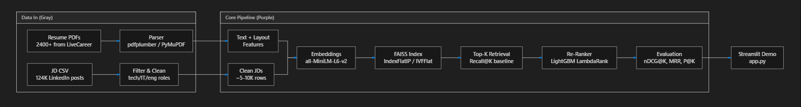

# Resume-JD Matcher

## Problem Statement

Matching resumes to job descriptions is a common but unsolved problem in recruiting workflows. This project builds a retrieval-and-reranking pipeline that identifies the best candidate resumes for a given JD and, vice versa, the best jobs for a given resume. It solves the end-to-end engineering challenge of embedding documents, retrieving candidates at scale, and scoring them with a simple reranker so you can compare a raw retrieval baseline against a learned second-stage model.

This repository is designed as a practical prototype for resume/job matching, with a focus on reproducibility, offline embedding usage, and explicit evaluation of baseline vs reranker performance.

## Architecture



The system is organized around three core stages:
1. Data and metadata ingestion from raw resume and job posting files.
2. Embedding-based retrieval using sentence-transformer vectors and either raw matrix search or FAISS indexing.
3. Reranking with LightGBM using synthetic labels derived from category and broad-field matches.

## Results

The following comparison was generated from the current pipeline using the available embeddings and a representative JD subset.

In the same experiment, the numeric results were:

| Method | nDCG@5 | nDCG@10 | MRR | P@5 |
|---|---|---|---|---|
| FAISS-only (cosine) | 0.0676 | 0.0840 | 0.1102 | 0.0550 |
| FAISS + LightGBM Re-ranker | 0.3310 | 0.3310 | 0.3310 | 0.1784 |

## How to Run

```bash
git clone https://github.com/Harpreet-afk/resume_JD_matcher.git
cd resume_JD_matcher
python -m venv venv
source venv/Scripts/activate   # Windows
# or: source venv/bin/activate   # macOS/Linux
python -m pip install --upgrade pip
python -m pip install -r requirements.txt
```

### Build or load embeddings

If you need to regenerate saved embeddings:

```bash
python scripts/build_embeddings.py
```

If you already have `data/resume_embeddings.npy` and `data/jd_embeddings.npy`, you can skip this step.

### Run the reranker notebook

Open `notebooks/re_ranker.ipynb` in Jupyter or VS Code and execute the cells to train and evaluate the LightGBM reranker.

## Limitations

- Labels are synthetic and approximate. The reranker is trained on heuristic category and broad-field matches, not real employer preference or click data.
- The dataset is modest in scale; the current demo uses only the provided resume and posting files, not a large production corpus.
- The reranker design is intentionally simple: it uses a handful of hand-crafted features rather than a full cross-encoder or end-to-end ranking model.
- FAISS support is optional in the current demo, and the app falls back to raw matrix search when `faiss` or the index file is unavailable.

## Future Work

- Replace synthetic labels with real interaction or click data from a hiring platform.
- Upgrade the retrieval model to larger or domain-specific embedder architectures.
- Add a cross-encoder re-ranker for higher precision on the top results.
- Improve candidate generation by combining keyword, semantic, and metadata signals.
- Add a lightweight production API and batch scoring pipeline for scalable deployment.
